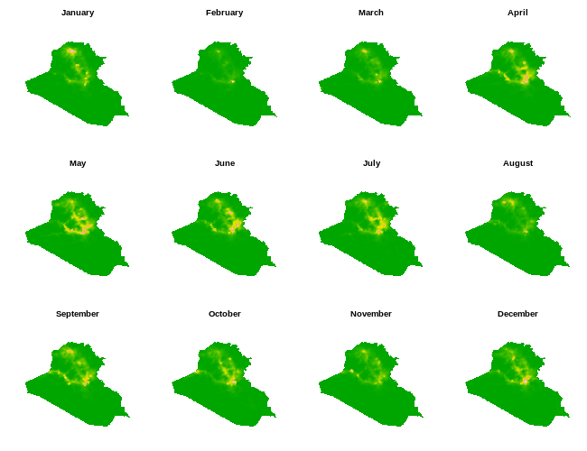

Summary
-------

R package for fitting a range of **s**patio**te**mporal models that
include **l**atent **fi**elds.

This package is under construction. It will eventually replace the
functionality offered by [`lgcpSPDE`](https://github.com/cmjt/lgcpSPDE).

To install run `devtools::install_github("cmjt/stelfi")`.

Fitting a hawkes process to Twitter data
----------------------------------------

    library(stelfi)
    data(retweetsNIWA)

    time <- retweetsNIWA
    ## numeric time stamps
    times <- as.numeric(difftime(time,min(time),units = "hour"))

    params <- c(mu = 50,alpha = 3,beta = 6)
    ## must have compiled TMB templates first use compile.stelfi()
    fit <- fit.hawkes(times = times,parameters = params,upper = c(100,5,15),lower = c(0,0,0))
    rep <- TMB::sdreport(fit)
    par <- summary(rep)[,1]

    ## print out estimated parameters
    par

    ##        mu     alpha      beta 
    ## 50.000000  3.035546 11.571315

Fitting a spatio-temporal log-Gaussian Cox process
--------------------------------------------------

     ## load data used in Python et. al. "The fall of the Islamic State in Iraq captured through a point process approach."
    data(iraq)
    ## create mesh using INLA functionality
    bdry <- INLA::inla.sp2segment(iraq$sp)
    locs <- cbind(x = iraq$occ$longitude, y =  iraq$occ$latitude)
    mesh <- INLA::inla.mesh.2d(loc = locs,boundary = bdry,
                         max.edge = c(0.2,0.4), cutoff = 0.15)
    ## must have compiled TMB templates first use compile.stelfi()
    ## will take a while
    fit <- fit.lgcp(locs = locs,temp.idx = as.factor(iraq$occ$imonth),mesh = mesh,
                    covs = iraq$covs.mesh,
                    parameters = list(beta = c(-1.066,-1.476,-5.622,0.05,0.01),
                                      log_kappa = -1.432, rho = 0.9),
                    sp = iraq$sp, tmb = TRUE)
    ## summary
    rep <- TMB::sdreport(fit)

    ## elements of random field
    random <- rep$par.random
    ## estimated parameters
    fixed <- rep$par.fixed
    ## plot 
    par(mfrow = c(3,4),mar = c(1,1,3,0))
    for(i in 1:12){
        x <- iraq$covs.mesh[[i]]%*%fixed[1:5] +  random[1:mesh$n + (i - 1)*mesh$n]
        show.field(exp(x[,1]), mesh,legend = FALSE,sp = iraq$sp,
                   axes = FALSE)
        title(main = names(table(lubridate::month(iraq$occ$imonth,abbr = FALSE,label = TRUE)))[i])
    }

