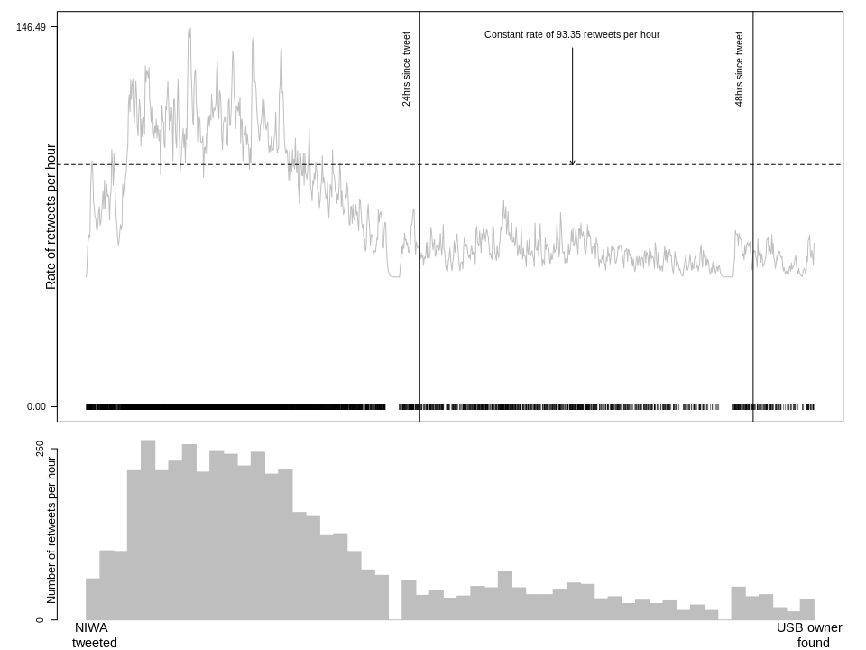

Fitting a Hawkes process to Twitter data
----------------------------------------

``` r
library(stelfi)
data(retweets_niwa)
```

``` r
time <- retweets_niwa
## numeric time stamps
times <- as.numeric(difftime(time,min(time),units = "hour"))
```

``` r
params <- c(mu = 50,alpha = 3,beta = 6)
## must have compiled TMB templates first use compile.stelfi()
fit <- fit.hawkes(times = times,parameters = params,upper = c(100,5,15),lower = c(0,0,0))
rep <- TMB::sdreport(fit)
par <- summary(rep)[,1]
```

``` r
## print out estimated parameters
par
```

    ##        mu     alpha      beta 
    ## 50.000000  3.035546 11.571315


