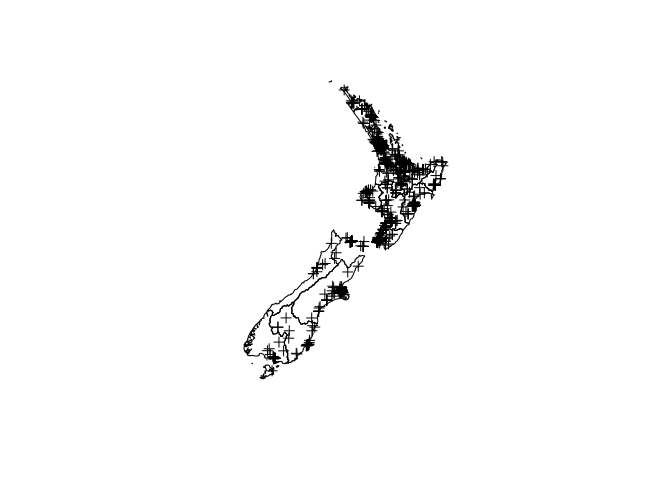

    library(stelfi)

NZ murders
----------

    data(murders_nz)
    head(murders_nz)

    ##    Latitude Longitude    Sex Age   Date Year                      Cause  Killer
    ## 1 -43.63394  171.6442   Male  41  Jan 5 2004                   stabbing  friend
    ## 2 -43.28563  172.1305   Male  46  Jan 8 2004            pick axe wounds  friend
    ## 3 -36.92575  174.8498   Male   0 Jan 15 2004 asphyxiation (suffocation)  mother
    ## 4 -43.55006  172.6327 Female  46  Feb 1 2004         blunt force trauma partner
    ## 5 -40.73297  175.1195   Male  10  Feb 2 2004                   stabbing  father
    ## 6 -40.73273  175.1193 Female   2  Feb 2 2004                   stabbing  father
    ##                      Name  Full_date    Month          Cause_cat     Region
    ## 1          Donald Linwood 2004-01-05  January     Violent weapon Canterbury
    ## 2             James Weeks 2004-01-08  January     Violent weapon Canterbury
    ## 3 Gabriel Harrison-Taylor 2004-01-15  January           Asphyxia   Auckland
    ## 4   Odette Lloyd-Rangiuia 2004-02-01 February Blunt force trauma Canterbury
    ## 5         Te Hau OCarroll 2004-02-02 February     Violent weapon Wellington
    ## 6        Ngamata OCarroll 2004-02-02 February     Violent weapon Wellington

Transform to NZTM
-----------------

Transform `data.frame` to `SpatialPointsDataFrame`

    murders_sp <- murders_nz
    ## project longitude & latitude to NZTMs
    coordinates(murders_sp) <- c("Longitude","Latitude")
    proj4string(murders_sp) <- CRS("+proj=longlat +datum=WGS84")
    murders_sp <-  spTransform(murders_sp, CRS("+proj=nzmg +lat_0=-41.0 +lon_0=173.0 +x_0=2510000.0 +y_0=6023150.0 +ellps=intl +units=m"))
    plot(murders_sp)
    plot(nz, add = TRUE)

