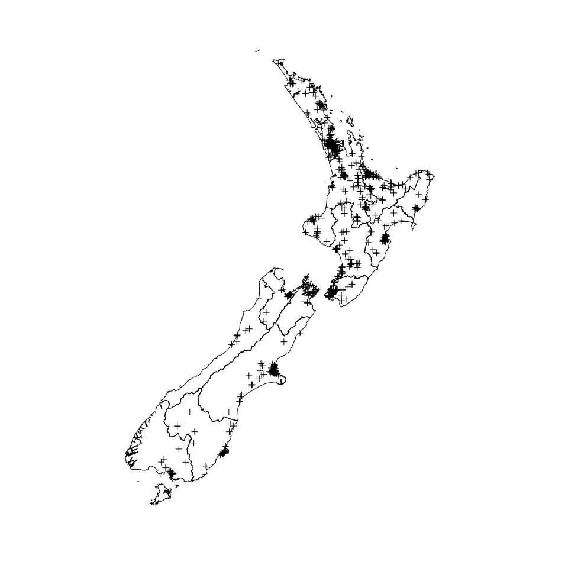
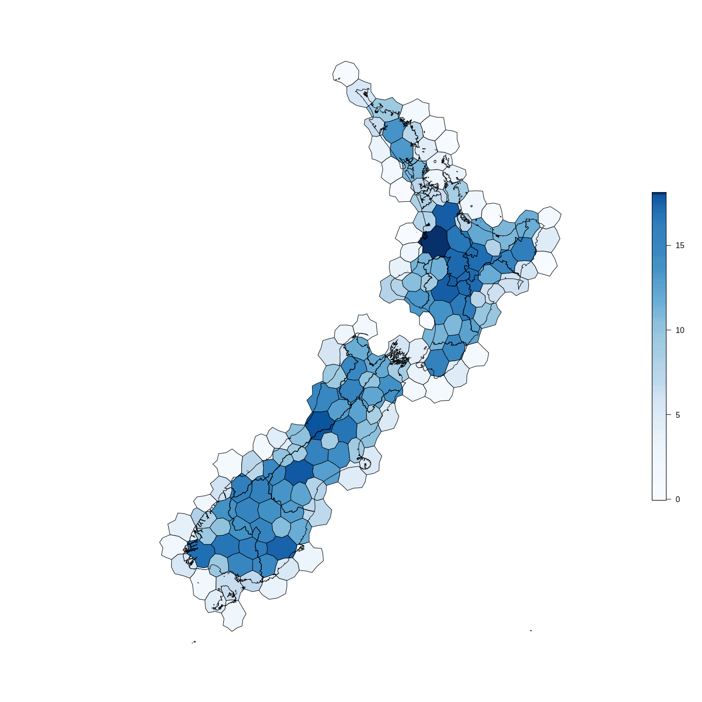

``` r
library(stelfi)
```

NZ murders
==========

The Data
--------

``` r
data(murders_nz)
dim(murders_nz)
```

    ## [1] 967  13

``` r
head(murders_nz)
```

    ##    Latitude Longitude    Sex Age   Date Year                      Cause  Killer
    ## 1 -43.63394  171.6442   Male  41  Jan 5 2004                   stabbing  friend
    ## 2 -43.28563  172.1305   Male  46  Jan 8 2004            pick axe wounds  friend
    ## 3 -36.92575  174.8498   Male   0 Jan 15 2004 asphyxiation (suffocation)  mother
    ## 4 -43.55006  172.6327 Female  46  Feb 1 2004         blunt force trauma partner
    ## 5 -40.73297  175.1195   Male  10  Feb 2 2004                   stabbing  father
    ## 6 -40.73273  175.1193 Female   2  Feb 2 2004                   stabbing  father
    ##                      Name  Full_date    Month          Cause_cat     Region
    ## 1          Donald Linwood 2004-01-05  January     Violent weapon Canterbury
    ## 2             James Weeks 2004-01-08  January     Violent weapon Canterbury
    ## 3 Gabriel Harrison-Taylor 2004-01-15  January           Asphyxia   Auckland
    ## 4   Odette Lloyd-Rangiuia 2004-02-01 February Blunt force trauma Canterbury
    ## 5         Te Hau OCarroll 2004-02-02 February     Violent weapon Wellington
    ## 6        Ngamata OCarroll 2004-02-02 February     Violent weapon Wellington

| Cause              |  Number|
|:-------------------|-------:|
| Asphyxia           |      47|
| Blunt force trauma |     285|
| Car crash          |     112|
| Drowning           |      16|
| Drugs              |      10|
| Fire               |      16|
| Other              |      72|
| Violent weapon     |     409|

| Year |  Number|
|:-----|-------:|
| 2004 |      38|
| 2005 |      72|
| 2006 |      66|
| 2007 |      55|
| 2008 |      71|
| 2009 |      94|
| 2010 |      71|
| 2011 |      62|
| 2012 |      64|
| 2013 |      59|
| 2014 |      55|
| 2015 |      65|
| 2016 |      56|
| 2017 |      45|
| 2018 |      76|
| 2019 |      18|

| Region            |  Number|
|:------------------|-------:|
| Auckland          |     267|
| Bay of Plenty     |      94|
| Canterbury        |     116|
| Gisborne          |      17|
| Hawke's Bay       |      44|
| Manawatu-Wanganui |      65|
| Marlborough       |       6|
| Nelson            |      16|
| Northland         |      49|
| Otago             |      30|
| Southland         |      19|
| Taranaki          |      27|
| Tasman            |       6|
| Waikato           |     108|
| Wellington        |      89|
| West Coast        |      11|

``` r
data(nz) ## SpatialPolygonsDataFrame of NZ (NZTM projection)
area_nz <- sum(raster::area(nz)) ## (m)
area_nzkm2 <- area_nz/1000^2 ## according to Google NZ is 268,021 km2
area_nzkm2
```

    ## [1] 268856.4

``` r
spatial_murder_rate <- nrow(murders_nz)/area_nzkm2 
temporal_murder_rate <- nrow(murders_nz)/length(table(murders_nz$Year)) 
st_murder_rate <- (nrow(murders_nz)/area_nzkm2)/length(table(murders_nz$Year)) 
```

Rate of murders per km<sup>2</sup> across NZ is calculated as 0.0036; there are roughly 60.438. The spatio-temporal murder rate across NZ 2004--2019 is 2.210^{-4} (rate per km<sup>2</sup> per year).

### Transform to NZTM

Transform `data.frame` to `SpatialPointsDataFrame`

``` r
murders_sp <- murders_nz
## project longitude & latitude to NZTMs
coordinates(murders_sp) <- c("Longitude","Latitude")
proj4string(murders_sp) <- CRS("+proj=longlat +datum=WGS84")
murders_sp <-  spTransform(murders_sp, 
                           CRS("+proj=nzmg +lat_0=-41.0 +lon_0=173.0 +x_0=2510000.0 +y_0=6023150.0 +ellps=intl +units=m"))
```

 *Locations of recorded (n = 967) murders in NZ 2004--2019*

log-Gaussian Cox process
------------------------

### Using INLA

**Steps below closely follow this [INLA-SPDE tutorial](https://becarioprecario.bitbucket.io/spde-gitbook/ch-lcox.html)**.

#### Creating the mesh

Typically when analysing point pattern data the point locations are not specified as the mesh nodes (i.e., locations are not given as an argument to `inla.mesh.2d()`). Instad we can supply the coordinates of the point pattern window (domain).

``` r
mesh <- inla.mesh.2d(loc.domain = coordinates(nz) ,
                     max.edge = c(86000, 100000), cutoff = 5000)
```

The SPDE approach for point pattern analysis defines the model at the nodes of the mesh. To fit the log-Cox point process model these points are considered as integration points. The method in Simpson et al. (2016) defines the expected number of events to be proportional to the area around the node (the areas of the polygons in the dual mesh, see below). This means that at the nodes of the mesh with larger triangles, there are also larger expected values.

``` r
## intersection between mesh and study area
weights <- stelfi:::get_weights(mesh, nz)
## these weights are the areas of each mesh triangle,
## required for the "exposure" aspect of the LGCP.
## the weights are set to zero if outside the study region
## as here the they should have no contribution. 
## the sum of the weights is the area of the study region
```

 *Delauney triangulation of the domain (white) overlain on the Voronoi diagram representing the weights (area surrounding) of each mesh node (diamonds). Observations are plotted as circles, mesh nodes outwith the domain are shown in grey.*

 *Voronoi diagram of the weights (areas in km2 around each mesh node).*

#### Spatial only LGCP

``` r
## number of mesh nodes
nodes <- mesh$n
## define model
spde <- inla.spde2.pcmatern(mesh = mesh,
  # PC-prior on range: P(practic.range < 0.05) = 0.01
  prior.range = c(0.05, 0.01),
  # PC-prior on sigma: P(sigma > 1) = 0.01
  prior.sigma = c(1, 0.01))
## vector for observations
y.pp <- rep(0:1, c(nodes, nrow(murders_sp)))
## exposure (E)
e.pp <- c(weights, rep(0, nrow(murders_sp)))
## integration points
imat <- Diagonal(nodes, rep(1, nodes))
## projection matrix for observed points
lmat <- inla.spde.make.A(mesh, coordinates(murders_sp))
## entire projection matrix
A.pp <- rbind(imat, lmat)
## data stack
stk.pp <- inla.stack(
  data = list(y = y.pp, e = e.pp), 
  A = list(1, A.pp),
  effects = list(list(b0 = rep(1, nodes + nrow(murders_sp))), 
                 list(i = 1:nodes)),
  tag = 'pp')
## fit model
pp.res <- inla(y ~ 0 + b0 + f(i, model = spde), 
  family = 'poisson', data = inla.stack.data(stk.pp), 
  control.predictor = list(A = inla.stack.A(stk.pp)), 
  E = inla.stack.data(stk.pp)$e)
## fixed effects
pp.res$summary.fixed
```

    ##         mean         sd 0.025quant  0.5quant 0.975quant      mode          kld
    ## b0 -19.44029 0.03226553  -19.50422 -19.44009  -19.37752 -19.43969 4.754885e-07

``` r
## expected number of murders at each mesh node
en <- exp(as.numeric(pp.res$summary.fixed[1]))*weights[ins]
sum(en) ## expected number across NZ, observed 967
```

    ## [1] 967.0586

 *Voronoi diagram of the expected number of murders per mesh node.*

#### Spatio-tempoal LGCP
