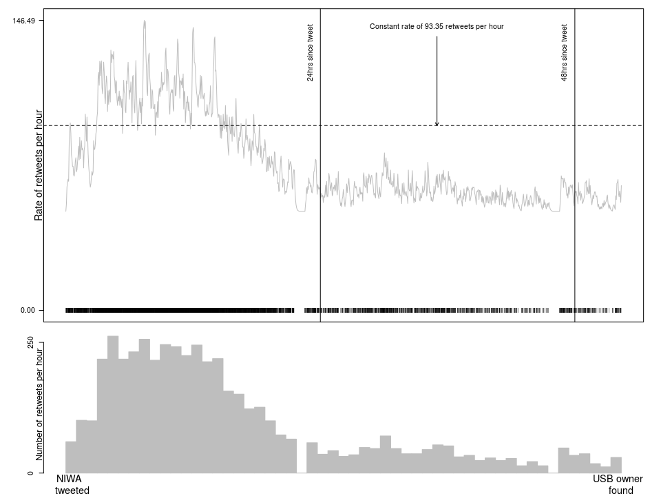

Summary
-------

R package for fitting a range of **s**patio**te**mporal models that
include **l**atent **fi**elds.

This package is under construction. It will eventually replace the
functionality offered by [`lgcpSPDE`](https://github.com/cmjt/lgcpSPDE).

To install run `devtools::install_github("cmjt/stelfi")`.

Fitting a hawkes process to Twitter data
----------------------------------------

    library(stelfi)
    data(retweetsNIWA)

    time <- retweetsNIWA
    ## numeric time stamps
    times <- as.numeric(difftime(time,min(time),units = "hour"))

    params <- c(mu = 50,alpha = 3,beta = 6)
    ## must have compiled TMB templates first use compile.stelfi()
    fit <- fit.hawkes(times = times,parameters = params,upper = c(100,5,15),lower = c(0,0,0))
    rep <- TMB::sdreport(fit)
    par <- summary(rep)[,1]

    par

    ##        mu     alpha      beta 
    ## 50.000000  3.035546 11.571315

