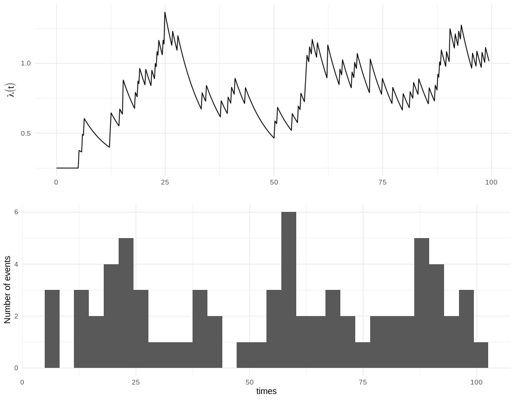
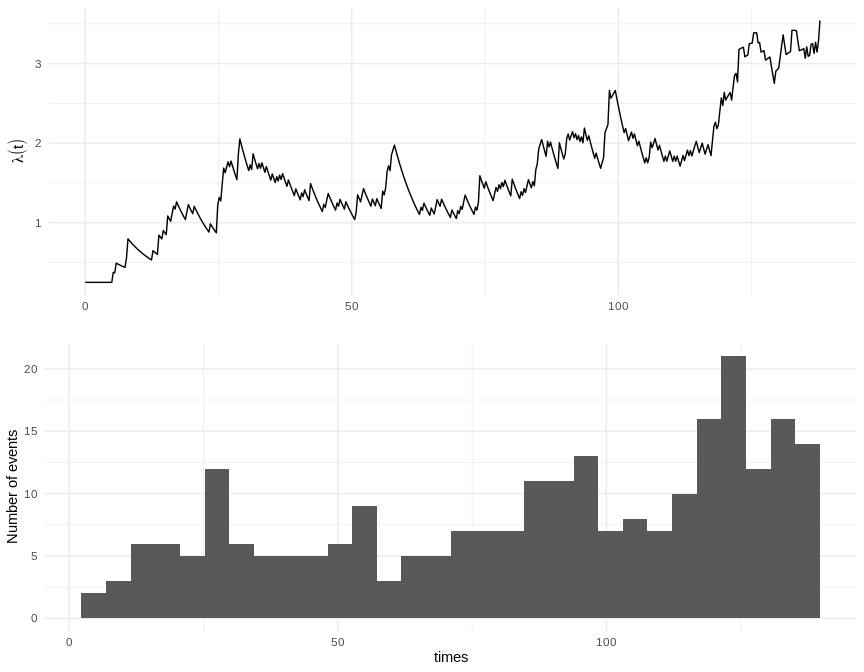

Before using the `TMB` templates in `stelfi` you should use
`compile_stelfi()` to compile them:

``` r
library(stelfi)
```

``` r
compile_stelfi()
```

## Fitting a Hawkes process model

### Modelling Twitter data

A [NIWA](https://niwa.co.nz/) scientist [found a working USB in the scat
of a leopard
seal](https://www.nzherald.co.nz/nz/news/article.cfm?c_id=1&objectid=12201147),
they then [tweeted about
it](https://twitter.com/niwa_nz/status/1092610541401587712) in the hopes
of finding its owner.

``` r
data(retweets_niwa)
head(retweets_niwa)
```

    ## [1] "2019-02-07 06:50:08 UTC" "2019-02-07 06:50:08 UTC"
    ## [3] "2019-02-07 06:49:22 UTC" "2019-02-07 06:48:48 UTC"
    ## [5] "2019-02-07 06:47:52 UTC" "2019-02-07 06:47:42 UTC"

``` r
## numeric time stamps
times <- sort(as.numeric(difftime(retweets_niwa ,min(retweets_niwa),units = "mins")))
```


``` r
params <- c(mu = 9, alpha = 3, beta = 10)
## must have compiled TMB templates first use compile_stelfi()
fit <- fit_hawkes(times = times,parameters = params) 
```

``` r
## print out estimated parameters
pars <- get_coefs(fit)
```

    ## outer mgc:  0.05723709 
    ## outer mgc:  0.05219274 
    ## outer mgc:  0.07775643 
    ## outer mgc:  0.05014284 
    ## outer mgc:  0.06433839 
    ## outer mgc:  0.06230766 
    ## outer mgc:  0.1479575 
    ## outer mgc:  0.08345936

``` r
pars
```

    ##         Estimate  Std. Error
    ## mu    0.06407076 0.017770342
    ## alpha 0.08018350 0.008060415
    ## beta  0.08345936 0.008407143

``` r
show_hawkes(times = times, mu = pars[1,1], alpha = pars[2,1], beta = pars[3,1])
```


### Modelling UK serial killer data

``` r
data(serial_uk)
## make date vector
times <- as.Date(paste(serial_uk$Date.of.first.kill, "/01", sep=''), "%m/%Y/%d")
times <- sort(lubridate::year(times) + lubridate::month(times)/12 - lubridate::year(min(times)))
```

``` r
params <- c(mu = 0.06,alpha = 0.006,beta = 0.01)
## must have compiled TMB templates first use compile_stelfi()
fit <- fit_hawkes(times = times,parameters = params) 
```

``` r
## print out estimated parameters
pars <- get_coefs(fit)
```

    ## outer mgc:  0.001155806 
    ## outer mgc:  0.004937551 
    ## outer mgc:  0.007238112 
    ## outer mgc:  0.0008875417 
    ## outer mgc:  0.001817195 
    ## outer mgc:  0.004639233 
    ## outer mgc:  0.004305363 
    ## outer mgc:  0.07784864

``` r
pars
```

    ##         Estimate Std. Error
    ## mu    0.07784864 0.03873487
    ## alpha 0.06004080 0.03170635
    ## beta  0.06514918 0.04405630

``` r
show_hawkes(times = times, mu = pars[1,1], alpha = pars[2,1], beta = pars[3,1])
```


### Modelling malaria data

Here we consider data from [*Using Hawkes Processes to model imported
and local malaria cases in near-elimination
settings*](https://dx.doi.org/10.1371%2Fjournal.pcbi.1008830). Data are
recorded line lists of individuals with malaria (caused by the
*Plasmodium vivax* parasite) in Yunnan Province, China between 1st
January 2011 to 24th September 2013. Data may be downloaded from
[here](https://dataverse.harvard.edu/dataset.xhtml?persistentId=doi:10.7910/DVN/YPRLIL)
as follows.

``` r
tmp <- tempfile(fileext = ".RData")
download.file("https://dataverse.harvard.edu/api/access/datafile/4443458",
              destfile = tmp)
load(tmp)
unlink(tmp)
```

``` r
str(china_malaria)
```

    ## 'data.frame':    2153 obs. of  3 variables:
    ##  $ time_onset : num  0 0 0 0 0 1 2 2 2 2 ...
    ##  $ time_jitter: num  0 0.202 0.372 0.573 0.908 ...
    ##  $ Imported   : int  1 0 0 0 1 1 0 1 1 1 ...

``` r
times <- china_malaria$time_jitter
```

``` r
params <- c(mu = 9, alpha = 3, beta = 10)
## must have compiled TMB templates first use compile_stelfi()
fit <- fit_hawkes(times = times,parameters = params) 
```

``` r
## print out estimated parameters
pars <- get_coefs(fit)
```

    ## outer mgc:  0.0333126 
    ## outer mgc:  0.01751538 
    ## outer mgc:  0.06489582 
    ## outer mgc:  0.01111469 
    ## outer mgc:  0.05556643 
    ## outer mgc:  0.03963868 
    ## outer mgc:  0.06001498 
    ## outer mgc:  0.2503022

``` r
pars
```

    ##        Estimate Std. Error
    ## mu    0.2503022 0.06561333
    ## alpha 0.1385181 0.01983419
    ## beta  0.1564190 0.02297087

``` r
show_hawkes(times = times, mu = pars[1,1], alpha = pars[2,1], beta = pars[3,1])
```


## Simulating a Hawkes process

**Set parameters**

``` r
mu <- 0.25
alpha <- 0.13
beta <- 0.15
```

### Option 1

Simulation algorithm as per [*On Lewis’ simulation method for point
processes*](https://ieeexplore.ieee.org/document/1056305)

``` r
sim1 <- sim_hawkes(mu = mu, alpha = alpha, beta = beta, plot = TRUE)
```



### Option 2

Simulation algorithm as per [*MLE of Hawkes’ self-exciting point
process*](%7Bhttps://radhakrishna.typepad.com/mle-of-hawkes-self-exciting-process.pdf)

``` r
sim2 <- sim_hawkes(mu = mu, alpha = alpha, beta = beta,n = 250, method = "2", plot = TRUE)
```



### Option 3

Using the TMB likelihood template; below we simulate another realisation
from the fitted `china_malaria` model:

``` r
sim3 <- fit$simulate()
dplyr::glimpse(sim3)
```

    ## List of 1
    ##  $ times: num [1:2153] 2.88 3.36 3.48 6.14 8.83 ...
