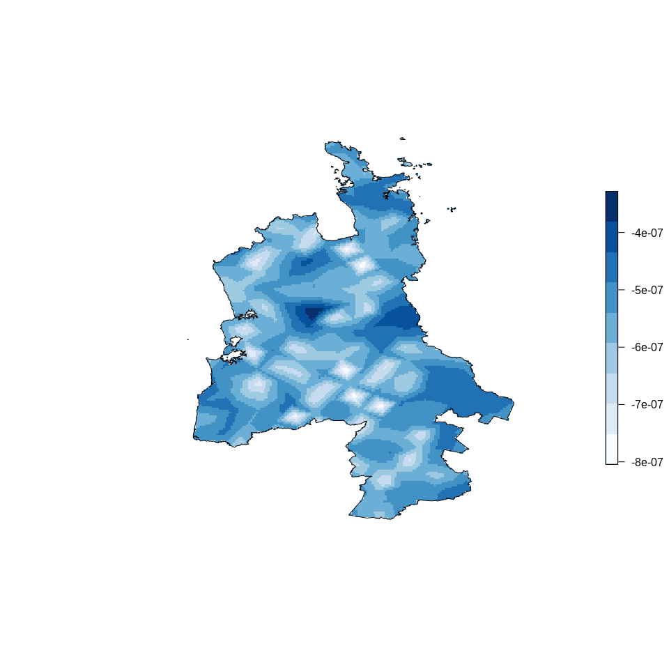

To install the `R` package `stelfi` run
`devtools::install_github("cmjt/stelfi")`, Use
`devtools::install_github("cmjt/stelfi",build_vignettes = TRUE)` if you
want to build vignettes at the same time.

    library(stelfi)

Modelling NZ murder locations as a log-Gaussian Cox process
===========================================================

The Data
--------

    data(murders_nz)
    dim(murders_nz)

    ## [1] 967  13

    head(murders_nz)

    ##    Latitude Longitude    Sex Age   Date Year                      Cause  Killer
    ## 1 -43.63394  171.6442   Male  41  Jan 5 2004                   stabbing  friend
    ## 2 -43.28563  172.1305   Male  46  Jan 8 2004            pick axe wounds  friend
    ## 3 -36.92575  174.8498   Male   0 Jan 15 2004 asphyxiation (suffocation)  mother
    ## 4 -43.55006  172.6327 Female  46  Feb 1 2004         blunt force trauma partner
    ## 5 -40.73297  175.1195   Male  10  Feb 2 2004                   stabbing  father
    ## 6 -40.73273  175.1193 Female   2  Feb 2 2004                   stabbing  father
    ##                      Name  Full_date    Month          Cause_cat     Region
    ## 1          Donald Linwood 2004-01-05  January     Violent weapon Canterbury
    ## 2             James Weeks 2004-01-08  January     Violent weapon Canterbury
    ## 3 Gabriel Harrison-Taylor 2004-01-15  January           Asphyxia   Auckland
    ## 4   Odette Lloyd-Rangiuia 2004-02-01 February Blunt force trauma Canterbury
    ## 5         Te Hau OCarroll 2004-02-02 February     Violent weapon Wellington
    ## 6        Ngamata OCarroll 2004-02-02 February     Violent weapon Wellington

<table>
<caption>Number of murders by province</caption>
<thead>
<tr class="header">
<th align="left">Region</th>
<th align="right">Number</th>
</tr>
</thead>
<tbody>
<tr class="odd">
<td align="left">Auckland</td>
<td align="right">267</td>
</tr>
<tr class="even">
<td align="left">Bay of Plenty</td>
<td align="right">94</td>
</tr>
<tr class="odd">
<td align="left">Canterbury</td>
<td align="right">116</td>
</tr>
<tr class="even">
<td align="left">Gisborne</td>
<td align="right">17</td>
</tr>
<tr class="odd">
<td align="left">Hawke's Bay</td>
<td align="right">44</td>
</tr>
<tr class="even">
<td align="left">Manawatu-Wanganui</td>
<td align="right">65</td>
</tr>
<tr class="odd">
<td align="left">Marlborough</td>
<td align="right">6</td>
</tr>
<tr class="even">
<td align="left">Nelson</td>
<td align="right">16</td>
</tr>
<tr class="odd">
<td align="left">Northland</td>
<td align="right">49</td>
</tr>
<tr class="even">
<td align="left">Otago</td>
<td align="right">30</td>
</tr>
<tr class="odd">
<td align="left">Southland</td>
<td align="right">19</td>
</tr>
<tr class="even">
<td align="left">Taranaki</td>
<td align="right">27</td>
</tr>
<tr class="odd">
<td align="left">Tasman</td>
<td align="right">6</td>
</tr>
<tr class="even">
<td align="left">Waikato</td>
<td align="right">108</td>
</tr>
<tr class="odd">
<td align="left">Wellington</td>
<td align="right">89</td>
</tr>
<tr class="even">
<td align="left">West Coast</td>
<td align="right">11</td>
</tr>
</tbody>
</table>

*Number of murders by province.*

    data(nz) ## SpatialPolygonsDataFrame of NZ (NZTM projection)
    area_nz <- sum(raster::area(nz)) ## (m)
    area_nzkm2 <- area_nz/1000^2 ## according to Google NZ is 268,021 km2
    area_nzkm2

    ## [1] 268856.4

    spatial_murder_rate <- nrow(murders_nz)/area_nzkm2 
    temporal_murder_rate <- nrow(murders_nz)/length(table(murders_nz$Year)) 
    st_murder_rate <- (nrow(murders_nz)/area_nzkm2)/length(table(murders_nz$Year)) 

There are on average 60.4 murders per year. The rate of murders per
km2 across NZ is roughly 0.004.

### Subset data to Waikato & transform to NZTM

Transform `data.frame` to `SpatialPointsDataFrame` and project Longitude
and Latitude to NZTM.

    murders_sp <- subset(murders_nz, murders_nz$Region == "Waikato")
    ## project longitude & latitude to NZTMs
    coordinates(murders_sp) <- c("Longitude","Latitude")
    proj4string(murders_sp) <- CRS("+proj=longlat +datum=WGS84")
    murders_sp <-  spTransform(murders_sp, 
                               CRS("+proj=nzmg +lat_0=-41.0 +lon_0=173.0 +x_0=2510000.0 +y_0=6023150.0 +ellps=intl +units=m"))
    waikato <- nz[nz$NAME_1 == "Waikato",]

<table>
<caption>Number of murders by category in Waikato 2004--2019</caption>
<thead>
<tr class="header">
<th align="left">Region</th>
<th align="right">Number</th>
</tr>
</thead>
<tbody>
<tr class="odd">
<td align="left">Asphyxia</td>
<td align="right">2</td>
</tr>
<tr class="even">
<td align="left">Blunt force trauma</td>
<td align="right">35</td>
</tr>
<tr class="odd">
<td align="left">Car crash</td>
<td align="right">13</td>
</tr>
<tr class="even">
<td align="left">Drowning</td>
<td align="right">1</td>
</tr>
<tr class="odd">
<td align="left">Fire</td>
<td align="right">4</td>
</tr>
<tr class="even">
<td align="left">Other</td>
<td align="right">13</td>
</tr>
<tr class="odd">
<td align="left">Violent weapon</td>
<td align="right">40</td>
</tr>
</tbody>
</table>

*Number of murders by category in Waikato 2004--2019.*

 *Locations of recorded
(n = 108) murders in Waikato 2004--2019*

log-Gaussian Cox process
------------------------

### `stelfi` as a wrapper for `INLA`

#### Creating the mesh

Typically when analysing point pattern data the point locations are not
specified as the mesh nodes (i.e., locations are not given as an
argument to `inla.mesh.2d()`). Instad we can supply the coordinates of
the point pattern window (domain).

    ## mesh max.edge on the same scale as the coords (NZTMs)
    mesh <- inla.mesh.2d(loc.domain = broom::tidy(waikato)[,1:2],
                         max.edge = c(11000,20000), cutoff = 15000)

#### Model fitting

    ## Spatial only
    fit <- fit_lgcp_inla(mesh = mesh, locs = coordinates(murders_sp), sp = waikato,
                         return.attributes = TRUE)
    summary(fit)

    ## 
    ## Call:
    ##    c("inla(formula = as.formula(formula), family = \"poisson\", data = 
    ##    inla.stack.data(stack), ", " E = inla.stack.data(stack)$e, verbose = 
    ##    verbose, control.predictor = list(A = inla.stack.A(stack), ", " compute 
    ##    = TRUE), control.inla = control.inla, control.fixed = control.fixed)" ) 
    ## Time used:
    ##     Pre = 0.902, Running = 4.45, Post = 0.201, Total = 5.55 
    ## Fixed effects:
    ##      mean    sd 0.025quant 0.5quant 0.975quant   mode kld
    ## b0 -19.24 0.096    -19.429   -19.24    -19.051 -19.24   0
    ## 
    ## Random effects:
    ##   Name     Model
    ##     field SPDE2 model
    ## 
    ## Model hyperparameters:
    ##                  mean    sd 0.025quant 0.5quant 0.975quant  mode
    ## Range for field 0.906 1.086      0.103    0.580      3.717 0.264
    ## Stdev for field 0.235 0.247      0.025    0.162      0.892 0.067
    ## 
    ## Expected number of effective parameters(stdev): 1.00(0.00)
    ## Number of equivalent replicates : 876.40 
    ## 
    ## Marginal log-Likelihood:  -2191.79 
    ## Posterior marginals for the linear predictor and
    ##  the fitted values are computed

    ## fixed effects
    fit$summary.fixed

    ##         mean         sd 0.025quant  0.5quant 0.975quant      mode          kld
    ## b0 -19.23967 0.09624817  -19.42864 -19.23968  -19.05086 -19.23967 1.086381e-24

    ## expected number of murders at each mesh node
    ## areas/weights at each mesh nodes, only returned if return.attribures = TRUE
    weights <- attributes(fit)$weights
    ins <- which(weights != 0)
    en <- exp(as.numeric(fit$summary.fixed[1]))*weights[ins]
    sum(en) ## expected number across Waikato, observed 108

    ## [1] 108.0193

    fields <- stelfi::get_fields(fit, mesh, mean = TRUE)
    grfs <- fields[[1]]
    show_field(grfs, mesh, dims = c(300,300),
             col = RColorBrewer::brewer.pal(9, "Blues"), sp = waikato,
                 rast = FALSE, legend = TRUE, legend.only = FALSE)

 *Estimated
mean of the assumed Gaussian Markov Random Field*

    fields <- stelfi::get_fields(fit, mesh, mean = FALSE)
    grfsd <- fields[[1]]
    show_field(grfsd, mesh, dims = c(300,300),
             col = RColorBrewer::brewer.pal(9, "Blues"), sp = waikato,
                 rast = FALSE)

*Standard error of the assumed Gaussian Markov Random Field*

##### Including a covariate

    ## include covariates
    ## The covariate shapefile used can be downloaded from
    ## https://koordinates.com/from/datafinder.stats.govt.nz/layer/8437/data/
    ## the code below assumes a single .shp (above) file is
    ## in a directory data/ relative to your working directory
    file <- list.files("data",pattern = ".shp", full = TRUE)
    layer <- rgdal::ogrListLayers(file)
    pop <- rgdal::readOGR(file, layer = layer)
    pop <- spTransform(pop, CRS("+proj=nzmg +lat_0=-41.0 +lon_0=173.0 +x_0=2510000.0 +y_0=6023150.0 +ellps=intl +units=m"))
    pop_mesh <- sp::over(SpatialPoints(mesh$loc[,1:2], proj4string = CRS(proj4string(murders_sp))),pop)$Population
    ## will obviously be NA at mesh nodes outside NZ
    pop_obs <- sp::over(murders_sp,pop)$Population
    ## population density covariate c at mesh nodes and then obs locations 
    covs <- data.frame(pop = c(pop_mesh, pop_obs))

    fit <- fit_lgcp_inla(mesh = mesh, locs = coordinates(murders_sp),covariates = covs, sp = waikato,
                         return.attributes = TRUE)
    weights <- attributes(fit)$weights
    ins <- which(weights != 0)
    en <- exp(as.numeric(fit$summary.fixed[1,1]) +
              as.numeric(fit$summary.fixed[2,1])*covs$pop[1:mesh$n][ins])*weights[ins]
    sum(en) ## expected number 

    ## [1] 108.021

    fields <- stelfi::get_fields(fit, mesh, mean = TRUE)
    grfs <- fields[[1]]
    show_field(grfs, mesh, dims = c(300,300),
             col = RColorBrewer::brewer.pal(9, "Blues"), sp = waikato,
                 rast = FALSE)

*Estimated mean of the assumed Gaussian Markov Random Field*

### "Raw" `INLA`

**Steps below closely follow this [INLA-SPDE
tutorial](https://becarioprecario.bitbucket.io/spde-gitbook/ch-lcox.html)**.

The SPDE approach for point pattern analysis defines the model at the
nodes of the mesh. To fit the log-Cox point process model these points
are considered as integration points. The method in Simpson et al.
(2016) defines the expected number of events to be proportional to the
area around the node (the areas of the polygons in the dual mesh, see
below). This means that at the nodes of the mesh with larger triangles,
there are also larger expected values.

    ## these weights are the areas of each mesh triangle,
    ## required for the "exposure" aspect of the LGCP.
    ## the weights are set to zero if outside the study region
    ## as here the they should have no contribution. 
    ## the sum of the weights is the area of the study region
    weights <- stelfi::get_weights(mesh = mesh, sp = waikato, plot = TRUE)

 *Delauney
triangulation of the domain (white) overlain on the Voronoi diagram
representing the weights (area surrounding) of each mesh node
(diamonds). Observations are plotted as circles, mesh nodes outwith the
domain are shown in white.*

 *Voronoi
diagram of the weights (shown as areas in km2 around each mesh node).*

    ## number of mesh nodes
    nodes <- mesh$n
    ## define model
    spde <- inla.spde2.pcmatern(mesh = mesh,
      # PC-prior on range: P(practic.range < 5) = 0.9
      prior.range = c(5, 0.9),
      # PC-prior on sigma: P(sigma > 1) = 0.005
      prior.sigma = c(1, 0.005))
    ## vector for observations
    y.pp <- rep(0:1, c(nodes, nrow(murders_sp)))
    ## exposure (E)
    e.pp <- c(weights, rep(0, nrow(murders_sp)))
    ## integration points
    imat <- Diagonal(nodes, rep(1, nodes))
    ## projection matrix for observed points
    lmat <- inla.spde.make.A(mesh, coordinates(murders_sp))
    ## entire projection matrix
    A.pp <- rbind(imat, lmat)
    ## data stack
    stk.pp <- inla.stack(
      data = list(y = y.pp, e = e.pp), 
      A = list(1, A.pp),
      effects = list(list(b0 = rep(1, nodes + nrow(murders_sp))), 
                     list(i = 1:nodes)),
      tag = 'pp')
    ## fit model
    pp.res <- inla(y ~ 0 + b0 + f(i, model = spde), 
      family = 'poisson', data = inla.stack.data(stk.pp), 
      control.predictor = list(A = inla.stack.A(stk.pp)), 
      E = inla.stack.data(stk.pp)$e)
    summary(pp.res)

    ## 
    ## Call:
    ##    c("inla(formula = y ~ 0 + b0 + f(i, model = spde), family = 
    ##    \"poisson\", ", " data = inla.stack.data(stk.pp), E = 
    ##    inla.stack.data(stk.pp)$e, ", " control.predictor = list(A = 
    ##    inla.stack.A(stk.pp)))") 
    ## Time used:
    ##     Pre = 2.25, Running = 7.46, Post = 0.165, Total = 9.88 
    ## Fixed effects:
    ##      mean    sd 0.025quant 0.5quant 0.975quant    mode kld
    ## b0 -19.24 0.096    -19.434  -19.238    -19.056 -19.234   0
    ## 
    ## Random effects:
    ##   Name     Model
    ##     i SPDE2 model
    ## 
    ## Model hyperparameters:
    ##              mean    sd 0.025quant 0.5quant 0.975quant  mode
    ## Range for i 0.906 1.086      0.103    0.580      3.717 0.264
    ## Stdev for i 0.235 0.247      0.025    0.162      0.892 0.067
    ## 
    ## Expected number of effective parameters(stdev): 1.00(0.00)
    ## Number of equivalent replicates : 876.40 
    ## 
    ## Marginal log-Likelihood:  -2191.79

    ## fixed effects
    pp.res$summary.fixed

    ##         mean         sd 0.025quant  0.5quant 0.975quant      mode          kld
    ## b0 -19.23973 0.09621845  -19.43379 -19.23792  -19.05585 -19.23433 2.156844e-07

    ## expected number of murders at each mesh node
    ins <- which(weights != 0)
    en <- exp(as.numeric(pp.res$summary.fixed[1]))*weights[ins]
    sum(en) ## expected number across Waikato, observed 108

    ## [1] 108.0135

 *Estimated mean of the
assumed Gaussian Markov Random Field*

##### Adding a covariate

    ## data stack
    stk.cov <- inla.stack(
      data = list(y = y.pp, e = e.pp), 
      A = list(1, A.pp),
      effects = list(list(b0 = rep(1, nodes + nrow(murders_sp)), pop = covs$pop), 
                     list(i = 1:nodes)),
      tag = 'pp')
    ## fit model
    pp.cov <- inla(y ~ 0 + b0 + pop + f(i, model = spde), 
      family = 'poisson', data = inla.stack.data(stk.cov), 
      control.predictor = list(A = inla.stack.A(stk.cov)), 
      E = inla.stack.data(stk.pp)$e)
    ## coefficients of the fixed effects
    pp.cov$summary.fixed

    ##             mean          sd    0.025quant     0.5quant   0.975quant
    ## b0  -20.20123667 0.181506218 -20.569392388 -20.19705462 -19.85654591
    ## pop   0.01139917 0.001410219   0.008623004   0.01140167   0.01415871
    ##             mode          kld
    ## b0  -20.18875653 5.675940e-07
    ## pop   0.01140679 1.026914e-06

    ## expected number of murders at each mesh node
    ins <- which(weights != 0)
    en <- exp(as.numeric(pp.cov$summary.fixed[1,1]) +
              as.numeric(pp.cov$summary.fixed[2,1])*covs$pop[1:mesh$n][ins])*weights[ins]
    sum(en) ## expected number 

    ## [1] 108.2694
